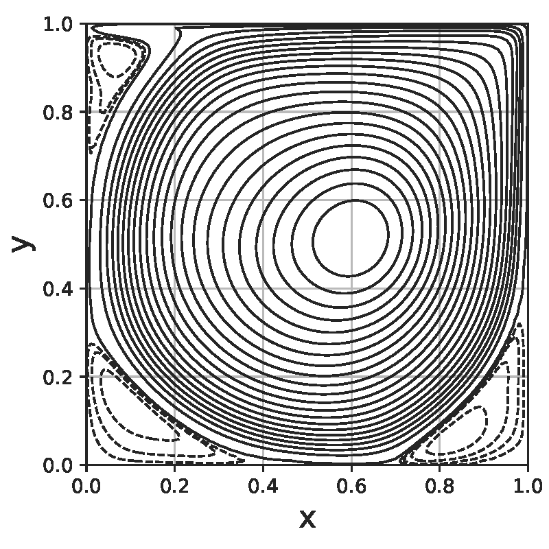

# MNT-2021-1_Lid-Driven_Cavity

## Setup

- Python version: 3.10

### Environment

1. To create, run

```bash
python -m venv mnt_venv
```
2. To activate, run

    - On Windows (git bash)
    ```bash
    source mnt_venv/Scripts/activate
    ```
    
    - On Linux
    ```bash
    source mnt_venv/bin/activate
    ```

3. To install the dependencies, run

```bash
pip install -r requirements.txt
```

## How to use

### Validation

- Explicit method

```bash
python validation.py --re 100 --tf 60
```

- Implicit method

```bash
python validation.py --re 100 --tf 60 --implicit --dt 0.005
```

### Flow for squared obstacle

## Results

### Validation

#### Maximum value of stream function

- dt = 0.001 and dx = dy = 0.01

|  Re  | This work<sup>1</sup> | This work<sup>2</sup> | Kim and Moin (1985) | Ghia *et al.* (1982) | Marchi *et al.* (2009) |
|:----:|:---------------------:|:---------------------:|:-------------------:|:--------------------:|:----------------------:|
|   1  |           -           |         0.0996        |        0.099        |           -          |   0.1001<sup>3</sup>   |
|  100 |         0.1033        |         0.1033        |        0.103        |         0.103        |         0.1035         |
|  400 |         0.1126        |         0.1126        |        0.112        |         0.114        |         0.1140         |
| 1000 |         0.1149        |         0.1149        |        0.116        |         0.118        |         0.1189         |

**1** - First order explicit method;

**2** - First order implicit method;

**3** - In this case *Re* number was 0.01.

- dt = 0.005 and dx = dy = 0.01

|  Re  | This work<sup>2</sup> |
|:----:|:---------------------:|
|   1  |         0.0965        |
|  100 |         0.1033        |
|  400 |         0.1125        |
| 1000 |         0.1148        |

#### Stream function contour plot

|              **Re = 1**              |              **Re = 10**              |
|:------------------------------------:|:-------------------------------------:|
|     |     |
|             **Re = 100**             |              **Re = 400**             |
|   |    |
|             **Re = 1000**            |             **Re = 10000**            |
|  |  |

### Flow for squared obstacle

## References

**[1]** - 