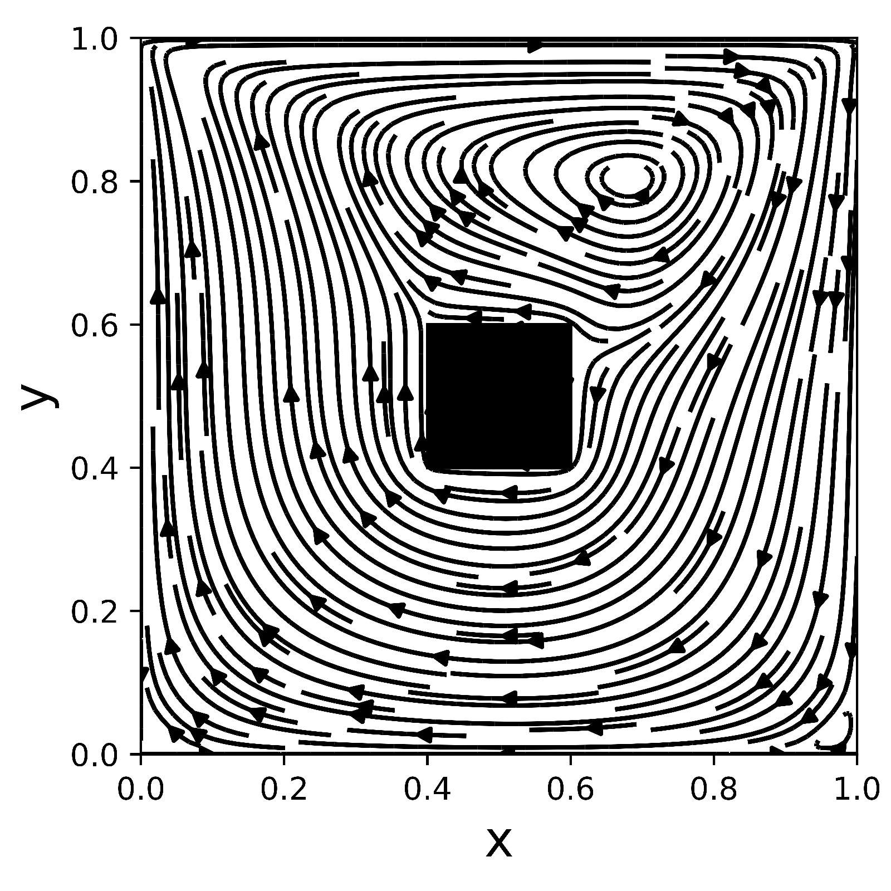
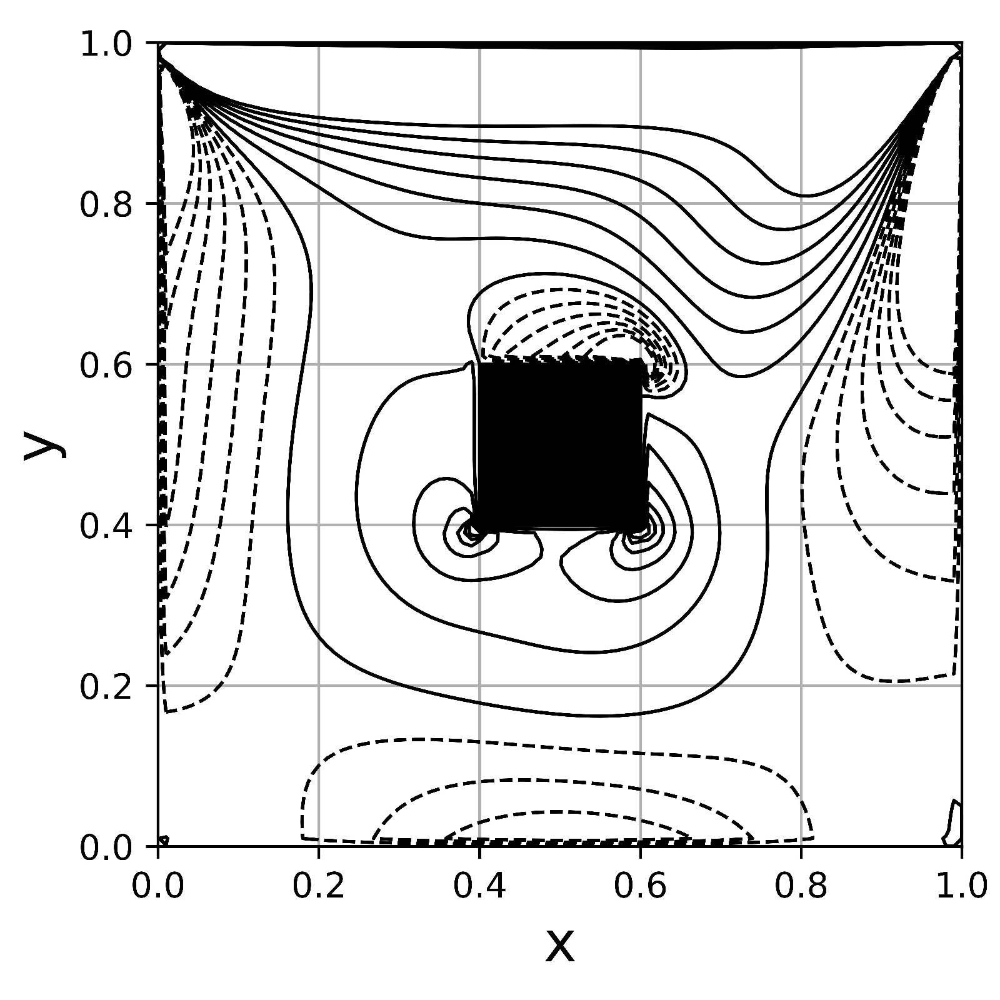

# MNT-2021-1_Lid-Driven_Cavity


## Setup

- Python version: 3.10

### Environment

1. To create, run

```bash
python -m venv mnt_venv
```
2. To activate, run

    - On Windows (git bash)
    ```bash
    source mnt_venv/Scripts/activate
    ```
    
    - On Linux
    ```bash
    source mnt_venv/bin/activate
    ```

3. To install the dependencies, run

```bash
pip install -r requirements.txt
```

## How to use

### Validation

- Explicit method

```bash
python main.py --re 100 --tf 60 --validation
```

- Implicit method

```bash
python main.py --re 100 --tf 60 --implicit --dt 0.001 --validation
```

### Flow for a square obstacle

- One centered obstacle

```bash
python main.py --re 100 --tf 60 --implicit --dt 0.001 --obstacle 40,40,20
```

- One obstacle on arbitrary position

```bash
python main.py --re 100 --tf 60 --implicit --dt 0.001 --obstacle 20,60,20
```

- Two obstacles on arbitrary position

```bash
python main.py --re 100 --tf 60 --implicit --dt 0.001 --num_obs 2 --obstacle 20,60,20,60,20,20
```

## Results

### Validation

#### Maximum value of stream function

- dt = 0.001 and dx = dy = 0.01

|  Re  | This work<sup>1</sup> | This work<sup>2</sup> | Kim and Moin (1985) | Ghia *et al.* (1982) | Marchi *et al.* (2009) |
|:----:|:---------------------:|:---------------------:|:-------------------:|:--------------------:|:----------------------:|
|   1  |           -           |         0.0996        |        0.099        |           -          |   0.1001<sup>3</sup>   |
|  100 |         0.1033        |         0.1033        |        0.103        |         0.103        |         0.1035         |
|  400 |         0.1126        |         0.1126        |        0.112        |         0.114        |         0.1140         |
| 1000 |         0.1149        |         0.1149        |        0.116        |         0.118        |         0.1189         |

**1** - First order explicit method; **2** - First order implicit method; **3** - In this case *Re* number was 0.01.

- dt = 0.005 and dx = dy = 0.01

|  Re  | This work<sup>2</sup> |
|:----:|:---------------------:|
|   1  |         0.0965        |
|  100 |         0.1033        |
|  400 |         0.1125        |
| 1000 |         0.1148        |

#### Stream function contour plot

|              **Re = 1**              |             **Re = 100**              |
|:------------------------------------:|:-------------------------------------:|
|     |    |
|             **Re = 400**             |             **Re = 1000**             |
|   |   |

#### Velocity *u* profile for x = 0.5

|                  **Re = 100**                  |                   **Re = 1000**                 |
|:----------------------------------------------:|:-----------------------------------------------:|
|  |  |

#### Vorticity contour plot

|                  **Re = 100**                 |                    **Re = 1000**               |
|:---------------------------------------------:|:----------------------------------------------:|
|  |  |

### Flow for a square obstacle

#### One centered obstacle streamlines plot

|                **Re = 1, L = 20**              |              **Re = 100,  L = 20**              |
|:----------------------------------------------:|:-----------------------------------------------:|
|    |   |
|               **Re = 400,  L = 20**            |              **Re = 1000,  L = 20**             |
|  |  |

#### One centered obstacle vorticity contour plot

|                **Re = 100, L = 20**               |                **Re = 1000, L = 20**               |
|:-------------------------------------------------:|:--------------------------------------------------:|
|  |  |

#### One obstacle in various positions streamlines plot

Results for *Re* = 400.

|              **40x60, L = 20**             |              **40x20, L = 20**             |
|:------------------------------------------:|:------------------------------------------:|
|  |  |
|              **20x40, L = 20**             |              **60x40, L = 20**             |
|  |  |

#### Two obstacles streamlines plot

Results for *Re* = 400.

|           **20x60 and 60x20, L = 20**         |           **40x20 and 40x60, L = 20**         |
|:---------------------------------------------:|:---------------------------------------------:|
|  |  |
|           **20x20 and 60x60, L = 20**         |           **20x40 and 60x40, L = 20**         |
|  |  |

## Major references

**[1]** - Chorin, A.J., 1968. "Numerical solution of the Navier-Stokes equations". *Mathematics of computation*;

**[2]** - Ghia, U., Ghia, K. and Shin, C., 1982. "High-Re solutions for incompressible flow using the Navier-Stokes equations and a multigrid method". *Journal of Computational Physics*;

**[3]** - Kim, J. and Moin, P., 1985. "Application of a fractional-step method to incompressible Navier-Stokes equations". *Journal of Computational Physics*;

**[4]** - Marchi, C.H., Suero, R. and Araki, L.K., 2009. "The lid-driven square cavity flow: Numerical solution with a 1024 x 1024 grid". *Journal of the Brazilian Society of Mechanical Science and Engineering*;

**[5]** - Rosa, A.P., 2021. "Roteiro para o Trabalho 5: Resolvendo o Problema do Escoamento de um Fluido em uma Cavidade com o Método de Projeção". Disciplina: Métodos Numéricos em Termofluidos, UnB;

**[6]** - Temám, R., 1969. "Sur l’approximation de la solution des équations de Navier-Stokes par la méthode des pas fractionnaires (II)". *Archive for Rational Mechanics and Analysis*.